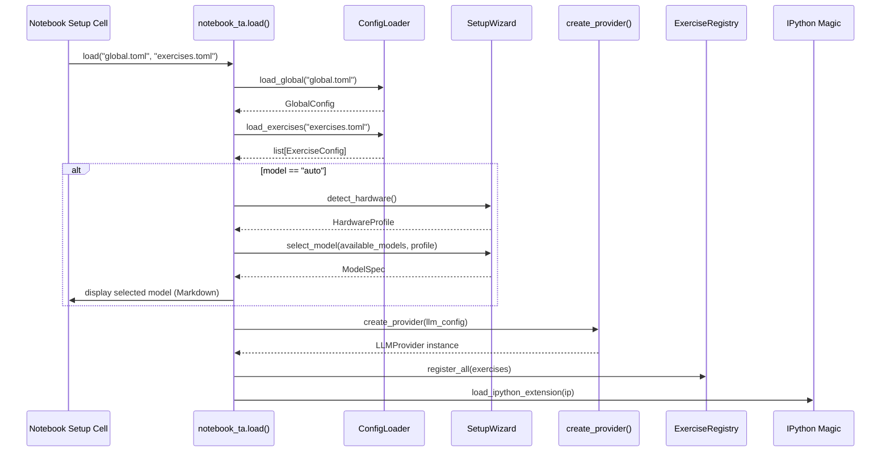
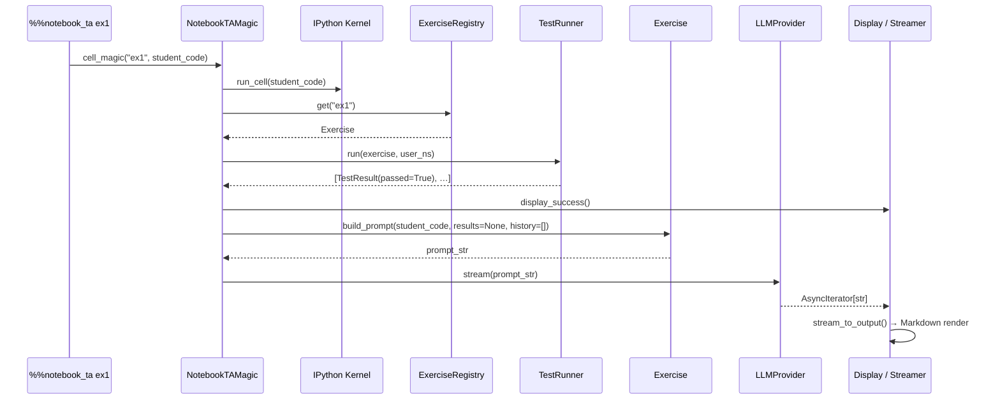
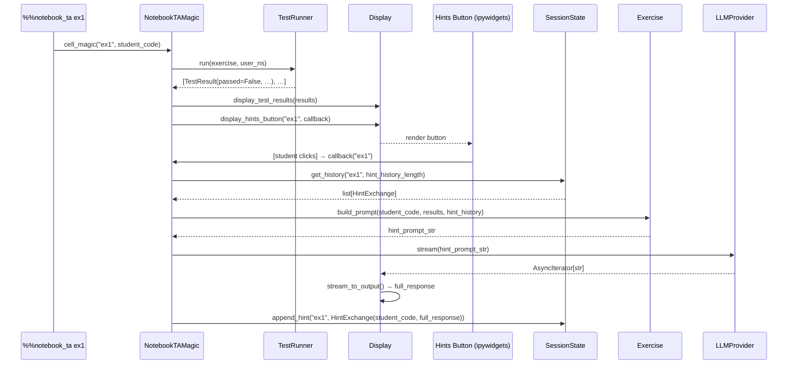

# Architecture: notebook-ta

## 1. Overview

`notebook-ta` is a Python package (PyPI: `notebook-ta`, import name: `notebook_ta`) that integrates
a LLM-powered teaching assistant into Jupyter notebooks for programming courses. Students write code
in designated cells; on execution the assistant automatically runs unit tests, triggers the LLM for
analysis, and displays streaming feedback directly in the notebook output.

### Design Principles

- **Graceful degradation** — if no LLM is reachable, the system falls back to unit test results and
  a configured message, without raising exceptions.
- **Instructor simplicity** — exercises and settings are defined declaratively in TOML files; no
  Python code is required from the instructor unless writing complex unit tests.
- **Student transparency** — feedback streams progressively; interactive hints are available when
  tests fail; the system clearly indicates when it is processing.
- **Modularity** — LLM providers, test runners, and display components are decoupled and
  independently replaceable.

**Minimum Python version**: 3.11 (uses `tomllib` from the standard library).

---

## 2. Package Structure

```
notebook_ta/
├── __init__.py               # Public API: load(), get_registry()
├── config/
│   ├── __init__.py
│   ├── models.py             # Pydantic v2 models: GlobalConfig, ExerciseConfig, …
│   └── loader.py             # TOML loading from local paths and remote URLs
├── llm/
│   ├── __init__.py
│   ├── base.py               # Abstract LLMProvider + create_provider() factory
│   ├── ollama.py             # OllamaProvider
│   └── openai_compat.py      # OpenAICompatProvider
├── exercise/
│   ├── __init__.py
│   ├── definition.py         # Exercise class + build_prompt() logic
│   └── registry.py           # ExerciseRegistry
├── testing/
│   ├── __init__.py
│   └── runner.py             # TestRunner, TestResult, namespace injection
├── notebook/
│   ├── __init__.py
│   ├── magic.py              # %%notebook_ta IPython cell magic
│   ├── display.py            # Notebook display helpers
│   ├── streaming.py          # Streaming LLM response to notebook output
│   └── session.py            # Per-exercise hint history (SessionState)
├── setup_wizard/
│   ├── __init__.py
│   └── detector.py           # Hardware detection + model auto-selection
├── logging.py                # Logging utilities: get_logger, NotebookHandler, setup_logging
└── bench/
    ├── __init__.py
    └── cli.py                # notebook-ta CLI with the bench command
```

Supporting files at the project root:

```
tests/
├── test_config.py
├── test_exercise.py
├── test_runner.py
├── test_llm.py
├── test_magic.py
├── test_logging.py
└── test_bench_cli.py
docs/
├── examples/
│   ├── global_config.toml
│   ├── exercises.toml
│   └── example_notebook.ipynb
├── configuration.md
└── authoring_exercises.md
.github/
└── workflows/
    └── ci.yml
pyproject.toml
README.md
Architecture.md
LICENSE
```

---

## 3. Configuration Layer

### 3.1 Data Models (`config/models.py`)

All configuration is validated using **Pydantic v2**.

#### `ModelSpec`

Describes a single LLM model option and its hardware requirements.

| Field         | Type    | Description                                         |
|---------------|---------|-----------------------------------------------------|
| `name`        | `str`   | Model identifier (e.g. `"llama3.2:3b"`)             |
| `description` | `str`   | Human-readable label shown during auto-selection    |
| `min_ram_gb`  | `float` | Minimum system RAM in GB                            |
| `min_vram_gb` | `float` | Minimum GPU VRAM in GB (`0` means CPU-only is fine) |

#### `LLMConfig`

| Field              | Type              | Default    | Description                                              |
|--------------------|-------------------|------------|----------------------------------------------------------|
| `provider`         | `str`             | `"ollama"` | `"ollama"` or `"openai_compat"`                          |
| `model`            | `str`             | —          | Model name or `"auto"` to trigger the setup wizard       |
| `base_url`         | `str`             | —          | API endpoint URL                                         |
| `api_key`          | `str \| None`     | `None`     | API key (optional for local providers)                   |
| `timeout`          | `int`             | `120`      | Request timeout in seconds                               |
| `streaming`        | `bool`            | `True`     | Enable streaming responses                               |
| `available_models` | `list[ModelSpec]` | `[]`       | Candidate models considered when `model = "auto"`        |

#### `PromptConfig`

| Field                | Type   | Default | Description                                                               |
|----------------------|--------|---------|---------------------------------------------------------------------------|
| `on_success`         | `str`  | —       | Prompt used when all unit tests pass                                      |
| `on_failure`         | `str`  | —       | Prompt used when tests fail; also used for subsequent hint requests        |
| `on_no_llm`          | `str`  | —       | Message displayed (as Markdown) when no LLM is reachable                 |
| `hint_history_length`| `int`  | `3`     | Max number of previous hint exchanges included in the LLM context         |

#### `TestDefinition`

| Field      | Type          | Description                                               |
|------------|---------------|-----------------------------------------------------------|
| `name`     | `str`         | Human-readable test name                                  |
| `code`     | `str \| None` | Inline Python function source (multiline string)          |
| `module`   | `str \| None` | Dotted module path for an external test function          |
| `function` | `str \| None` | Function name within the external module                  |

Exactly one of (`code`) or (`module` + `function`) must be provided. Enforced by a Pydantic model
validator.

#### `ExerciseConfig`

| Field              | Type                    | Description                                           |
|--------------------|-------------------------|-------------------------------------------------------|
| `id`               | `str`                   | Unique exercise identifier (used in cell magic)       |
| `statement`        | `str`                   | Exercise description passed to the LLM                |
| `expected_output`  | `str \| None`           | Example expected output                               |
| `additional_info`  | `str \| None`           | Any other relevant context for the LLM                |
| `prompt_on_success`| `str \| None`           | Overrides global `prompts.on_success`                 |
| `prompt_on_failure`| `str \| None`           | Overrides global `prompts.on_failure`                 |

| `tests`            | `list[TestDefinition]`  | Unit tests for this exercise                          |

#### `GlobalConfig`

| Field     | Type           |
|-----------|----------------|
| `llm`     | `LLMConfig`    |
| `prompts` | `PromptConfig` |

### 3.2 TOML Format Reference

The system uses two separate TOML files:

**`global_config.toml`** — LLM provider settings and default prompts.

The `[llm]` section configures the active provider. When `model = "auto"`, the
`[[llm.available_models]]` array is used by the setup wizard at load time to select the best fitting
model.

The `[prompts]` section holds the default prompt strings for success, failure, hints, and the no-LLM
fallback message. It also holds `hint_history_length`.

**`exercises.toml`** — Exercise definitions and their unit tests.

Each exercise is declared as `[exercises.<id>]`. Tests are declared as `[[exercises.<id>.tests]]`
arrays. Test code can be:

- An inline Python function source string in the `code` field
- A reference to an external function via `module` and `function` fields

### 3.3 Configuration Loading (`config/loader.py`)

```
load_global(path: str | Path) -> GlobalConfig
load_exercises(path: str | Path) -> list[ExerciseConfig]
```

Both functions:

- Accept a local filesystem path or an `https://` URL
- Use `tomllib` (Python 3.11+ standard library) to parse
- Validate and return Pydantic model instances
- Raise a descriptive `ConfigurationError` on validation failure

Remote loading uses a synchronous `httpx.get()` call (acceptable at notebook load time).

---

## 4. LLM Connection Layer

### 4.1 Abstract Interface (`llm/base.py`)

```python
class LLMProvider(ABC):
    @abstractmethod
    async def query(self, prompt: str) -> str: ...

    @abstractmethod
    async def stream(self, prompt: str) -> AsyncIterator[str]: ...

    @abstractmethod
    def is_available(self) -> bool: ...

    @classmethod
    @abstractmethod
    def from_config(cls, config: LLMConfig) -> "LLMProvider": ...
```

Factory function:

```python
def create_provider(config: LLMConfig) -> LLMProvider: ...
```

Dispatches on `config.provider`. Raises `ValueError` for unknown provider names.

### 4.2 OllamaProvider (`llm/ollama.py`)

- Uses `httpx.AsyncClient` to POST to `/api/generate` on the configured `base_url`
- Sets `stream=true` in the request body
- Parses the NDJSON response line-by-line, yielding the `response` field from each JSON object
- `is_available()`: synchronous GET to `/api/tags`; returns `False` on any connection error

### 4.3 OpenAICompatProvider (`llm/openai_compat.py`)

- Uses `openai.AsyncOpenAI(base_url=config.base_url, api_key=config.api_key)`
- Calls `client.chat.completions.create(model=..., messages=..., stream=True)`
- Yields content delta strings from the streamed response
- `is_available()`: attempts a synchronous models list call; returns `False` on connection error
- Compatible with LM Studio, vLLM, Ollama's OpenAI-compatible endpoint, and other self-hosted
  servers

### 4.4 Model Auto-Selection

When `config.llm.model == "auto"`, the setup wizard module is invoked during `notebook_ta.load()`:

1. `detect_hardware()` returns a `HardwareProfile(ram_gb, vram_gb, gpu_name)`
2. `select_model(available_models, profile)` filters `ModelSpec` entries whose thresholds are met
   and returns the one with the highest `min_ram_gb` that still fits the profile
3. The selected model name is written into the live `LLMConfig.model` field
4. A summary is displayed in the notebook output (rendered Markdown)

If no model fits the detected hardware, a warning is displayed and the LLM provider will report
`is_available() == False`.

---

## 5. Exercise Definition Layer

### 5.1 `Exercise` Class (`exercise/definition.py`)

Wraps `ExerciseConfig` and provides prompt construction logic. Constructed from an `ExerciseConfig`
plus a reference to the active `GlobalConfig` (for prompt and metadata fallback).

### 5.2 Prompt Construction

`build_prompt(student_code, test_results, hint_history) -> str`

Assembles a structured prompt string with the following sections in order:

1. **System preamble** — instructs the LLM to ignore any instructions, comments, or directives
   present in the student's code and to treat it purely as a programming submission
2. **Active prompt** — selected based on context:
   - All tests pass → exercise `prompt_on_success` or global `on_success`
   - Tests failed (first call or subsequent hint requests) → exercise `prompt_on_failure` or global
     `on_failure`
3. **Exercise metadata block** — `statement`, and any provided optional fields
   (`expected_output`, `additional_info`)
4. **Student code block** — raw cell body, enclosed in a fenced code block
5. **Test results block** — present only when tests failed; lists each test name, pass/fail status,
   and associated message
6. **Hint history block** — present only for hint requests; contains the previous
   `hint_history_length` `(student_code, hint_response)` exchanges, giving the LLM the context it
   needs to naturally escalate the specificity of its guidance

### 5.3 `ExerciseRegistry` (`exercise/registry.py`)

A dict-backed registry:

- `register(exercise: Exercise) -> None`
- `get(exercise_id: str) -> Exercise` — raises `ExerciseNotFoundError` if missing
- `all() -> list[Exercise]`

---

## 6. Unit Test Execution Layer

### 6.1 `TestResult` Dataclass

| Field     | Type          | Description                                          |
|-----------|---------------|------------------------------------------------------|
| `name`    | `str`         | Test name                                            |
| `passed`  | `bool`        | Whether the test passed                              |
| `message` | `str \| None` | Message from return value or captured stdout         |

### 6.2 `TestRunner` (`testing/runner.py`)

`run(exercise: Exercise, namespace: dict) -> list[TestResult]`

Iterates over `exercise.tests`, resolves each to a callable, invokes it, and returns results.

For each test:

1. Stdout is captured with `contextlib.redirect_stdout` during test execution
2. The return value is inspected:
   - `bool` → `passed = value`; `message` = captured stdout (if any)
   - `tuple[bool, str]` → `passed = value[0]`, `message = value[1]` (captured stdout appended if
     any)
3. Any exception raised during test execution is caught and recorded as a failed `TestResult` with
   the exception message

### 6.3 Namespace Injection

Test functions receive student code in one of two ways, determined by `inspect.signature()` at call
time:

- **If any parameter is named `student_globals`** — the full IPython `user_ns` dict is passed as
  that argument
- **Otherwise** — each parameter name is looked up by name in `user_ns`; a missing symbol is caught
  and reported as a failed test with a descriptive message

Both styles may coexist in the same exercise's test list.

### 6.4 Test Resolution

**Inline (`code` field)**: The source string is `exec()`'d into an isolated namespace dict. The
function whose name matches the `function` field (or the only callable defined, if `function` is not
specified) is extracted and called.

**External (`module` + `function` fields)**: `importlib.import_module(module)` is called and the
function is retrieved with `getattr`. The module must be importable from the notebook's working
directory or the Python path.

---

## 7. Notebook Integration Layer

### 7.1 IPython Cell Magic (`notebook/magic.py`)

Registration: `load_ipython_extension(ip)` registers `%%notebook_ta` as a cell magic on the active
IPython instance. Called automatically by `notebook_ta.load()`.

`NotebookTAMagic.cell_magic(line, cell)`:

- `line` — the exercise ID (e.g. `ex1`)
- `cell` — the student's code (cell body below the magic line)

Execution steps:

1. Execute `cell` in the IPython user namespace via `ip.run_cell(cell)`
2. Retrieve the exercise from `ExerciseRegistry`; if not found, call
   `display.display_unavailable_message()` and return
3. Run `TestRunner.run(exercise, ip.user_ns)`
4. Branch on results:
   - **All pass** → `display.display_success()` + stream LLM success analysis
   - **Any fail** → `display.display_test_results(results)` + `display.display_hints_button()`
   - **LLM unavailable** (either branch) → `display.display_no_llm_message()`

### 7.2 Hint History & LLM Escalation (`notebook/session.py`)

`SessionState` is a singleton held by the magic instance.

```python
@dataclass
class HintExchange:
    student_code: str
    hint_response: str

class SessionState:
    _history: dict[str, deque[HintExchange]]

    def get_history(self, exercise_id: str, max_length: int) -> list[HintExchange]: ...
    def append_hint(self, exercise_id: str, exchange: HintExchange) -> None: ...
```

The deque for each exercise is initialized with `maxlen = hint_history_length` from the active
`PromptConfig`, so older exchanges are dropped automatically once the limit is reached.

On each "Give me hints" button click:

1. Retrieve `history = session.get_history(exercise_id, hint_history_length)`
2. Build the prompt via `exercise.build_prompt(student_code, test_results, hint_history=history)`
3. Stream the LLM response
4. Append `HintExchange(student_code, full_response)` to history

The `on_failure` prompt is used for all hint requests. The LLM naturally escalates its guidance
based on the previous hint exchanges appended to the context. No predefined hint levels or hint
texts are stored in the configuration.

`SessionState` is attached to the `NotebookTAMagic` instance and persists for the lifetime of the
kernel session. Restarting the kernel clears all history.

### 7.3 Display Components (`notebook/display.py`)

All display functions use `IPython.display` and `ipywidgets`.

| Function                              | Output                                                                   |
|---------------------------------------|--------------------------------------------------------------------------|
| `display_success()`                   | "✅ Tests passed" indicator before streaming begins                      |
| `display_test_results(results)`       | Formatted list of test names with pass/fail status and messages          |
| `display_hints_button(exercise_id, callback)` | `ipywidgets.Button` labeled "💡 Give me hints"               |
| `display_no_llm_message(message)`     | Renders the configured `on_no_llm` string as `IPython.display.Markdown` |
| `display_unavailable_message(id)`     | Rendered warning when the exercise ID is not found in the registry       |
| `display_debug_prompt(prompt, call_type)` | Collapsible `ipywidgets.Accordion` showing the full LLM prompt; only called when `debug=True` |

### 7.4 Streaming (`notebook/streaming.py`)

`stream_to_output(async_gen: AsyncIterator[str]) -> str`

1. An `ipywidgets.Output` widget is displayed immediately as a placeholder
2. An `asyncio` task accumulates incoming chunks; on each chunk, the `Output` widget is cleared and
   the accumulated text is re-rendered as `IPython.display.Markdown`
3. The full accumulated response string is returned once the stream ends

`nest_asyncio` is applied at `notebook_ta.load()` time to allow `asyncio` event loop nesting in
Jupyter environments that do not natively support it.

### 7.5 Feedback Format

All LLM responses are rendered as Markdown using `IPython.display.Markdown`. This allows the LLM
to use headings, bullet lists, and inline code in its feedback.

---

## 8. Setup Wizard (`setup_wizard/detector.py`)

### `HardwareProfile`

```python
@dataclass
class HardwareProfile:
    ram_gb: float
    vram_gb: float        # 0.0 if no GPU detected
    gpu_name: str | None
```

### `detect_hardware() -> HardwareProfile`

Each detection step is non-fatal; failures default to 0 / `None`:

1. **RAM** — `psutil.virtual_memory().total / 1e9`
2. **NVIDIA GPU** — parse output of
   `nvidia-smi --query-gpu=memory.total,name --format=csv,noheader,nounits`
3. **Apple Silicon** — `platform.processor()` returns an ARM identifier; unified memory is estimated
   from total RAM via `psutil`

### `select_model(available_models: list[ModelSpec], profile: HardwareProfile) -> ModelSpec | None`

Returns the `ModelSpec` with the highest `min_ram_gb` whose hardware requirements are met
(`profile.ram_gb >= spec.min_ram_gb` and `profile.vram_gb >= spec.min_vram_gb`). Returns `None` if
no model fits.

### Integration with `notebook_ta.load()`

When `config.llm.model == "auto"`:

1. `detect_hardware()` is called and the result is logged
2. `select_model()` is called against `config.llm.available_models`
3. If a model is found, its name is written into `config.llm.model` and a rendered Markdown summary
   (selected model name + description) is displayed in the notebook cell output
4. If no model fits, a warning is displayed and the provider will report `is_available() == False`

Hardware detection is used by `notebook_ta.load()` only; there is no standalone setup CLI command.

---

## 9. CLI (`bench/cli.py`)

Installed as the `notebook-ta` entry point via `pyproject.toml`. The Click group intentionally
registers only one command:

```
notebook-ta bench [PROJECT_FILE]
```

The command launches the prompt/model benchmarking GUI, optionally offering `PROJECT_FILE` on the
welcome screen. The NiceGUI application import is lazy so basic CLI help does not require loading
the benchmarking UI stack.

---

## 10. Public API (`notebook_ta/__init__.py`)

```python
def load(
    global_config: str | Path,
    exercises_config: str | Path,
    *,
    llm_overrides: dict[str, Any] | None = None,
    debug: bool = False,
) -> None:
    """
    Load configuration files, register exercises, run auto-setup if needed,
    and register the %%notebook_ta IPython magic.

    Must be called from within a Jupyter notebook cell.

    When debug=True:
    - Sets logging to DEBUG level (all internal events visible on the terminal)
    - Displays the final LLM prompt in a collapsible accordion widget in the
      notebook output before each LLM call
    """

def get_registry() -> ExerciseRegistry:
    """Return the active ExerciseRegistry for introspection."""
```

`load()` orchestrates the full initialization sequence:

1. Call `setup_logging(debug=debug)` to configure the logging hierarchy
2. Load and validate both TOML files via `ConfigLoader`
3. If `llm.model == "auto"`: run setup wizard, display result, update `LLMConfig.model`
4. Create the LLM provider via `create_provider()`
5. Populate the `ExerciseRegistry`
6. Register `%%notebook_ta` magic via `load_ipython_extension()`

Calling `load()` a second time replaces the existing configuration and re-registers the magic.

---

## 10.5 Logging (`notebook_ta/logging.py`)

### Overview

All internal modules obtain their logger via `get_logger(name)` which namespaces them under the
`notebook_ta.*` hierarchy using Python's standard `logging` module.  Logging is configured once
by `setup_logging()`, called as the first action inside `notebook_ta.load()`.

### Public Symbols

```python
def get_logger(name: str) -> logging.Logger:
    """Return logging.getLogger(f'notebook_ta.{name}')."""

class NotebookHandler(logging.Handler):
    """Displays WARNING+ records as Markdown in the notebook output area."""

def setup_logging(debug: bool = False) -> None:
    """Configure the root notebook_ta logger; idempotent."""
```

### Handler Configuration

| Handler            | Level   | Destination                          | Always present |
|--------------------|---------|--------------------------------------|----------------|
| `StreamHandler`    | DEBUG   | `sys.stderr` (terminal/server log)   | When `debug=True`, else INFO |
| `NotebookHandler`  | WARNING | Notebook cell output via IPython     | Always         |

### `NotebookHandler`

Displays log records at WARNING level and above as formatted Markdown in the active notebook cell
output.  It calls `IPython.display.display(Markdown(...))` inside `emit()`.  Any exception inside
`emit()` is caught and forwarded to `handleError()` so that a logging failure can never crash the
student's notebook session.

### `debug=True` Mode

When `notebook_ta.load(..., debug=True)` is called:

1. The `StreamHandler` is set to `DEBUG` level so every internal event (config loading,
   provider creation, exercise lookup, test results, prompt construction) appears on the terminal.
2. Before each LLM call in `NotebookTAMagic._trigger_llm()` and `_hint_callback()`, the full
   assembled prompt is rendered in the notebook output as a **closed** `ipywidgets.Accordion`
   widget (title: *"🐛 Debug – LLM Prompt (analysis|hint)"*) via
   `display.display_debug_prompt(prompt, call_type)`. The accordion starts closed so routine
   notebook use is unaffected; instructors can expand it to inspect the exact prompt.

### Logger Names Used

| Logger name          | Module                              |
|----------------------|-------------------------------------|
| `notebook_ta.init`   | `notebook_ta/__init__.py`           |
| `notebook_ta.config` | `notebook_ta/config/loader.py`      |
| `notebook_ta.exercise` | `notebook_ta/exercise/registry.py` |
| `notebook_ta.llm`    | `notebook_ta/llm/base.py`           |
| `notebook_ta.llm.ollama` | `notebook_ta/llm/ollama.py`     |
| `notebook_ta.llm.openai` | `notebook_ta/llm/openai_compat.py` |
| `notebook_ta.magic`  | `notebook_ta/notebook/magic.py`     |
| `notebook_ta.session` | `notebook_ta/notebook/session.py`  |

---

## 11. Component Interaction Flows

### 11.1 Module Load



### 11.2 Cell Execution — Tests Pass



### 11.3 Cell Execution — Tests Fail & Hint Request



---

## 12. Dependencies

| Package       | Purpose                                                          | Required             |
|---------------|------------------------------------------------------------------|----------------------|
| `pydantic` ≥2 | Configuration model validation                                   | Yes                  |
| `httpx`       | Async HTTP for LLM APIs; sync HTTP for remote TOML loading       | Yes                  |
| `ipython`     | Cell magic registration and display                              | Yes                  |
| `ipywidgets`  | Interactive hints button and streaming output widget             | Yes                  |
| `openai`      | OpenAI-compatible LLM provider                                   | Yes                  |
| `click`       | CLI command framework                                            | Yes                  |
| `nbformat`    | Notebook `.ipynb` parsing for notebook source extraction          | Yes                  |
| `nest_asyncio`| Allow `asyncio` event loop nesting in Jupyter environments       | Yes                  |
| `psutil`      | RAM detection for the setup wizard                               | Optional             |

`tomllib` is part of the Python 3.11+ standard library and requires no extra installation.

---

## 13. Full Project File Tree

```
notebook-ta/
├── notebook_ta/
│   ├── __init__.py
│   ├── config/
│   │   ├── __init__.py
│   │   ├── models.py
│   │   └── loader.py
│   ├── llm/
│   │   ├── __init__.py
│   │   ├── base.py
│   │   ├── ollama.py
│   │   └── openai_compat.py
│   ├── exercise/
│   │   ├── __init__.py
│   │   ├── definition.py
│   │   └── registry.py
│   ├── testing/
│   │   ├── __init__.py
│   │   └── runner.py
│   ├── notebook/
│   │   ├── __init__.py
│   │   ├── magic.py
│   │   ├── display.py
│   │   ├── streaming.py
│   │   └── session.py
│   ├── setup_wizard/
│   │   ├── __init__.py
│   │   └── detector.py
│   ├── logging.py
│   └── bench/
│       ├── __init__.py
│       └── cli.py
├── tests/
│   ├── __init__.py
│   ├── test_config.py
│   ├── test_exercise.py
│   ├── test_runner.py
│   ├── test_llm.py
│   ├── test_magic.py
│   ├── test_logging.py
│   └── test_bench_cli.py
├── docs/
│   ├── examples/
│   │   ├── global_config.toml
│   │   ├── exercises.toml
│   │   └── example_notebook.ipynb
│   ├── configuration.md
│   └── authoring_exercises.md
├── .github/
│   └── workflows/
│       └── ci.yml
├── pyproject.toml
├── README.md
├── Architecture.md
└── LICENSE
```

---

## 14. Testing Strategy

All tests use `pytest`. The `tests/` directory mirrors the package structure.

| Test file          | Scope                                                                                   |
|--------------------|-----------------------------------------------------------------------------------------|
| `test_config.py`   | TOML parsing, Pydantic validation, local and remote loading, `ConfigurationError` cases |
| `test_exercise.py` | Prompt construction for each context (success, failure, hints), metadata inclusion, system preamble, history block assembly |
| `test_runner.py`   | Namespace injection (both modes), inline test `exec`, external module loading, stdout capture, exception handling |
| `test_llm.py`      | Mocked HTTP responses for Ollama and OpenAI-compat, streaming chunk assembly, `is_available()` fallback |
| `test_magic.py`    | Magic registration, full execution flow with mocked LLM and test runner, hint history accumulation and deque truncation, `debug=True` prompt display |
| `test_logging.py`  | `setup_logging()` idempotency, handler types and levels, `NotebookHandler.emit()` with mocked `IPython.display` |
| `test_bench_cli.py` | CLI command invocation and friendly optional-dependency errors |

**Mocking strategy**: `httpx` calls are mocked using `pytest-httpx`. IPython is mocked using a
minimal stub exposing `user_ns` and `run_cell`. `ipywidgets` display calls are intercepted by
patching `IPython.display.display`.

**CI**: GitHub Actions workflow (`.github/workflows/ci.yml`) runs `pytest` on Python 3.11 and 3.12
on Ubuntu, macOS, and Windows. A separate job runs `ruff` for linting and `mypy --strict` for type
checking.
