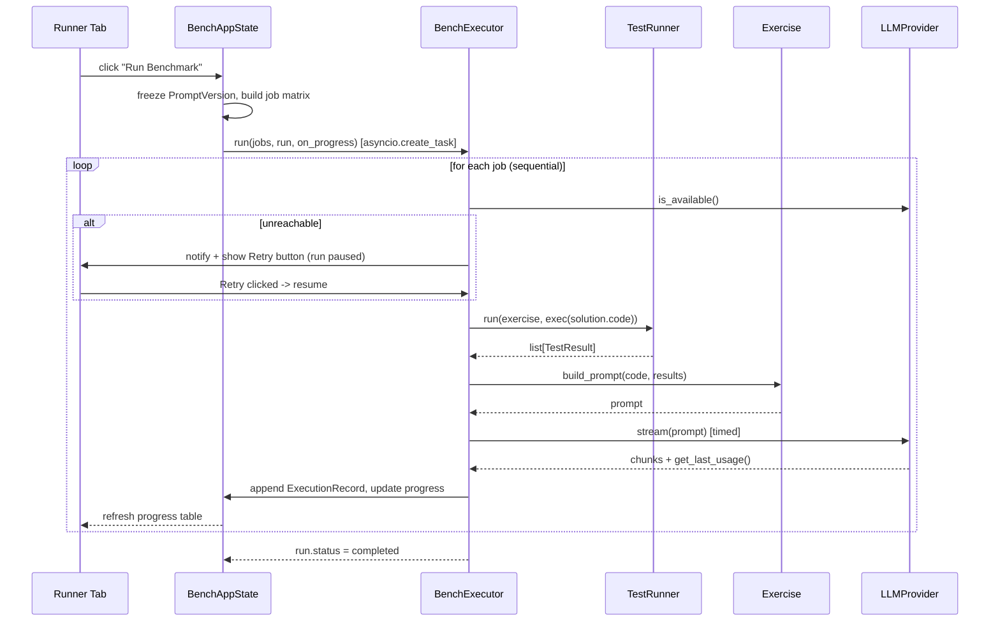

# Architecture: Prompt Benchmarking Tool (`notebook-ta bench`)

## 1. Overview & Scope

This document describes the software architecture for the benchmarking tool defined in
[PromptBenchmarking.md](PromptBenchmarking.md). The tool is a **local, single-user GUI application**
(Python + [NiceGUI](https://nicegui.io)) distributed as part of the `notebook-ta` package and launched
via `notebook-ta bench`. It lets an instructor iterate on system prompts, compare LLM/model
combinations against a catalog of exercises and student solutions, and inspect performance metrics
(TTFT, generation time, throughput).

It is an **authoring/evaluation tool**, not part of the student-facing runtime. It reuses the core
`notebook_ta` package (configuration models, LLM providers, exercise/prompt construction, unit test
runner) wherever possible instead of re-implementing equivalent logic.

### Non-goals

- Multi-user / networked deployment (single local user, single browser tab assumed).
- Persistent database (SQLite, etc.) — persistence is a single JSON project file, per spec §10.
- Automatic LLM-based scoring/grading of benchmark outputs — the tool only supports **manual**
  side-by-side comparison; the "internal model" is used solely to help author student solutions
  (spec §6), not to judge tested outputs.

---

## 2. Key Design Decisions

These decisions were clarified with the project owner and drive the rest of this document:

| # | Topic | Decision |
|---|-------|----------|
| 1 | Execution concurrency | **Fully sequential.** One LLM call in flight at a time across the whole exercise×solution×model matrix. Simplest and safest for local Ollama hardware; avoids resource contention and keeps metrics (TTFT, throughput) uncontaminated by concurrent load. |
| 2 | Student solutions storage | **JSON-only.** Student solutions and tags live exclusively in the benchmarking project file, keyed by exercise ID from the TOML catalog. No writeback to `exercises.toml`. |
| 3 | Prompt versioning granularity | **Bundled.** `on_success` + `on_failure` are frozen together as a single `PromptVersion` snapshot each time "Run Benchmark" is clicked. |
| 4 | Model configuration | **Reuse `notebook_ta.llm`.** Each tested model (and the internal model) is a standard `LLMConfig`, instantiated via the existing `create_provider()` factory. Mixed providers (Ollama + OpenAI-compatible) can be tested in the same run. |
| 5 | Stale/drift detection scope | **Broad.** The drift hash covers exercise `statement`, `expected_output`, `additional_info`, the serialized unit test definitions, and the student solution code. Any change to any of these marks a result stale. |
| 6 | Autosave trigger | **Fixed interval timer** (configurable, default 60s) while autosave is enabled, in addition to the always-available manual "Save" button. |

### Security boundary

The GUI binds to `127.0.0.1` and has no authentication; it is a single-operator local authoring
tool. Solution, setup, and test code is executed in timeout-bounded workers, not in the NiceGUI
server process. Workers are not sandboxes: they retain the host user's OS permissions, filesystem,
environment, and network access, and direct-process termination does not guarantee cleanup of
descendants. Benchmark projects and exercise catalogs must therefore be trusted unless the whole
application is run inside an OS-level isolation boundary. See
[`docs/security.md`](../docs/security.md) for the complete trust and data model.
| 7 | Throughput metrics | **Provider-reported token counts when available, else word-count approximation.** `LLMProvider` gains an additive `get_last_usage()` hook (see §7). |
| 8 | CLI project handling | `notebook-ta bench [PROJECT_FILE]` accepts an **optional path argument**; omitted → blank new project. |

---

## 3. Relationship to the Core `notebook_ta` Package

| Core component | Reused as-is | Notes |
|----------------|--------------|-------|
| `config.models.LLMConfig` / `ExerciseConfig` / `TestDefinition` | ✅ | Tested models, internal model, and the exercise catalog all use these models directly. |
| `config.loader.load_exercises()` | ✅ | Loads the source TOML catalog referenced by the project. |
| `llm.base.create_provider()` / `LLMProvider` | ✅ (extended additively, see §7) | One provider instance per tested model + one for the internal model. |
| `exercise.definition.Exercise` / `build_prompt()` | ✅ | Prompt assembly logic (system preamble, success/failure branching, test results, code block) is identical to the notebook runtime — this is exactly what the tool needs to benchmark. |
| `testing.runner.TestRunner` / `TestResult` | ✅ | Runs unit tests against a namespace built by `exec()`-ing the student solution text (see §9.3), instead of an IPython kernel namespace. |
| `notebook.streaming` / `notebook.display` | ❌ Not reused | Those modules are `ipywidgets`/`IPython.display` specific. The bench tool renders streaming output into NiceGUI elements instead (new code, see §11). |
| `logging.get_logger()` | ✅ | Bench modules log under `notebook_ta.bench.*`. |
| `bench.cli.cli` (click group) | ✅ | The `notebook-ta` entry point registers only the `bench` command. |

---

## 4. Package Structure

```
notebook_ta/
├── llm/
│   └── base.py                 # + TokenUsage dataclass, get_last_usage() hook (additive)
└── bench/
    ├── __init__.py
    ├── cli.py                  # `notebook-ta` click group with the `bench` command
    ├── app.py                  # NiceGUI bootstrap: create_app(), main()
    ├── catalog.py              # Style-preserving local TOML exercise authoring
    ├── state.py                 # BenchAppState singleton (in-memory, per-process)
    ├── models.py                # Pydantic v2 models: BenchProject and everything it contains
    ├── storage.py                # ProjectStore: load/save JSON, autosave timer, dirty tracking
    ├── hashing.py                # compute drift hashes, is_stale()
    ├── executor.py                # BenchJob, BenchExecutor (sequential async queue + metrics)
    ├── internal_model.py          # InternalModelService: generate solution drafts
    └── ui/
        ├── __init__.py
        ├── layout.py             # Top-level page: tabs shell, save/autosave indicator, close guard
        ├── welcome_dialog.py     # Persistent recent/new project chooser
        ├── native_dialogs.py     # Async wrappers around native file/directory pickers
        ├── tag_badges.py         # Shared contrast-aware colored tag rendering
        ├── settings_tab.py
        ├── exercises_tab.py
        ├── runner_tab.py
        └── compare_tab.py
```

Supporting additions:

```
tests/
├── test_bench_models.py
├── test_bench_storage.py
├── test_bench_hashing.py
├── test_bench_executor.py
├── test_bench_internal_model.py
└── test_bench_cli.py
docs/
└── benchmarking.md             # User-facing guide (mirrors authoring_exercises.md style)
```

---

## 5. Data Model (`bench/models.py`)

All models are **Pydantic v2**, mirroring the conventions of `config/models.py`. The entire tree is
what gets serialized to/from the project JSON file (spec §10).

### `BenchSettings`

| Field | Type | Description |
|-------|------|--------------|
| `internal_model` | `LLMConfig` | Model used to generate draft student solutions. |
| `python_path_dirs` | `list[str]` | Directories appended to `sys.path` for external test helper modules. Read live (not snapshotted) by `BenchExecutor` and the Exercises tab's "Run tests" button, so edits apply immediately. |
| `known_tags` | `list[str]` | Shared, editable tag vocabulary offered when tagging student solutions or generating drafts with the internal model. |
| `tag_colors` | `dict[str, str]` | Per-tag hex colors used by Settings, Exercises, and Compare badges. Missing or invalid colors use a neutral fallback. |
| `autosave_enabled` | `bool` | Default `True`. |
| `autosave_interval_seconds` | positive `int` | Default `60`. |
| `exercises_toml_path` | `str \| None` | Path to the source exercise catalog. |

### `StudentSolution`

| Field | Type | Description |
|-------|------|--------------|
| `id` | `str` (uuid4) | Stable identifier, independent of exercise/content changes. |
| `exercise_id` | `str` | Foreign key into the loaded `ExerciseConfig.id`. |
| `label` | `str` | Short user-facing name (e.g. "Off-by-one error"). |
| `code` | `str` | The student solution source. |
| `tags` | `list[str]` | Free-form tags, e.g. `"correct"`, `"wrong complexity"`. |
| `generated_by_internal_model` | `bool` | Provenance flag. |
| `created_at` / `updated_at` | `datetime` | |

### `PromptVersion`

| Field | Type | Description |
|-------|------|--------------|
| `id` | `str` | Sequential label, e.g. `"V1"`, `"V2"` (assigned by `BenchProject.next_prompt_version_id()`). |
| `created_at` | `datetime` | Freeze timestamp. |
| `on_success` | `str` | Frozen copy of the active on-success prompt. |
| `on_failure` | `str` | Frozen copy of the active on-failure prompt. |

### `ModelUnderTest`

| Field | Type | Description |
|-------|------|--------------|
| `label` | `str` | Unique display name, e.g. `"llama3.2:3b (ollama)"`. Used as the join key throughout the UI and execution records. |
| `llm_config` | `BenchLLMConfig` | Persistable connection spec (provider, base URL, model, API-key environment-variable reference, timeout, temperature). Secret values are resolved only at runtime and are never serialized. |

### `BenchmarkRun`

One row per "Run Benchmark" click.

| Field | Type | Description |
|-------|------|--------------|
| `id` | `str` (uuid4) | |
| `name` | `str` | User-supplied label (e.g. "Baseline prompt"), defaults to `"Run N"` if left blank. |
| `prompt_version_id` | `str` | The `PromptVersion` frozen for this run. |
| `model_labels` | `list[str]` | Snapshot of which `ModelUnderTest` labels were selected. |
| `job_count` | `int` | Total jobs enqueued (exercises × solutions × models at click time). |
| `status` | `Literal["running", "paused", "completed", "cancelled"]` | |
| `started_at` / `finished_at` | `datetime \| None` | |

### `InputSnapshot`

Captured verbatim (not just hashed) so that a stale cell can still render the exact historical
inputs, and so the drift hash can be recomputed if the hashing algorithm ever changes.

| Field | Type |
|-------|------|
| `exercise_statement` | `str` |
| `expected_output` | `str \| None` |
| `additional_info` | `str \| None` |
| `tests_serialized` | `str` (canonical JSON dump of `list[TestDefinition]`) |
| `student_code` | `str` |
| `exercise_hash` | `str` (sha256) |
| `student_hash` | `str` (sha256) |
| `combined_hash` | `str` (sha256 of `exercise_hash + student_hash`) |

### `TokenUsage` and `ExecutionMetrics`

```python
class TokenUsage(BaseModel):
    prompt_tokens: int | None
    completion_tokens: int | None
    approximate: bool          # True when word-count fallback was used

class ExecutionMetrics(BaseModel):
    time_to_first_token_s: float | None
    total_generation_time_s: float
    throughput_tokens_per_s: float | None
    token_usage: TokenUsage
```

### `ExecutionRecord`

One row per completed (or failed) job — the atomic unit shown in the Compare matrix.

| Field | Type | Description |
|-------|------|--------------|
| `id` | `str` (uuid4) | |
| `run_id` | `str` | FK → `BenchmarkRun.id`. |
| `exercise_id` | `str` | |
| `solution_id` | `str` | |
| `model_label` | `str` | |
| `prompt_version_id` | `str` | |
| `input_snapshot` | `InputSnapshot` | |
| `full_prompt` | `str` | Exact string sent to the LLM (from `Exercise.build_prompt()`). |
| `test_results` | `list[TestResultModel]` | Serializable mirror of `testing.runner.TestResult`. |
| `llm_output` | `str` | |
| `metrics` | `ExecutionMetrics` | |
| `status` | `Literal["completed", "failed"]` | |
| `error` | `str \| None` | Populated when `status == "failed"`. |
| `created_at` | `datetime` | |

### `BenchProject` (root)

```python
class BenchProject(BaseModel):
    schema_version: int = 2
    settings: BenchSettings
    draft_prompt_on_success: str = ""
    draft_prompt_on_failure: str = ""
    draft_selected_model_labels: list[str] = []
    draft_run_name: str = ""
    solutions: list[StudentSolution] = []
    prompt_versions: list[PromptVersion] = []
    models_under_test: list[ModelUnderTest] = []
    runs: list[BenchmarkRun] = []
    execution_records: list[ExecutionRecord] = []
```

`draft_*` fields persist the instructor's in-progress Runner tab state (spec §4.A "Active
Workspace") so it survives save/reload, distinct from frozen `PromptVersion` snapshots.

Lookup helpers (implemented as plain methods on `BenchProject`, not stored):

- `latest_record(exercise_id, solution_id, model_label, prompt_version_id) -> ExecutionRecord | None`
- `known_combinations(exercise_id, solution_id) -> list[tuple[model_label, prompt_version_id]]` — feeds
  the Compare tab's historical multi-select list.
- `next_prompt_version_id() -> str` — `f"V{len(self.prompt_versions) + 1}"`.

---

## 6. Persistence Layer (`bench/storage.py`)

```python
class ProjectStore:
    def __init__(self, path: Path | None) -> None: ...
    def load(self) -> BenchProject: ...
    def save(self, project: BenchProject) -> None: ...
    def save_as(self, project: BenchProject, path: Path) -> None: ...
```

- `save()` writes `project.model_dump_json(indent=2)` atomically (write to a temp file in the same
  directory, then `os.replace()`) to avoid corrupting the project file if the process is killed
  mid-write.
- `load()` uses `BenchProject.model_validate_json()`; a `schema_version` mismatch raises a
  `BenchProjectError` with a descriptive message (mirrors `ConfigurationError` conventions).
- No implicit remote loading (unlike `config.loader`) — project files are always local.

### Autosave & dirty tracking

- `BenchAppState` (see §11) marks the project **dirty** on every mutation (solution edit, prompt
  draft edit, run completion, etc.).
- A NiceGUI `ui.timer(interval=settings.autosave_interval_seconds, callback=...)` checks the dirty
  flag and calls `ProjectStore.save()` when both `autosave_enabled` and `dirty` are true, then clears
  the flag.
- The manual **Save** button (present in the top bar across all tabs, per spec §10) is always
  enabled and calls `store.save()` directly, clearing the dirty flag immediately.
- Unsaved-changes guard: `layout.py` injects a `beforeunload` handler via
  `ui.run_javascript` bound to the dirty flag, so closing the browser tab with unsaved changes
  prompts a native confirmation dialog.

---

## 7. LLM Integration & Metrics Instrumentation

### 7.1 Additive extension to `llm/base.py`

The existing `LLMProvider.stream()` only yields text chunks — no token-count metadata channel. To
satisfy decision #7 (provider-reported counts with fallback) without touching the notebook runtime's
behavior, `LLMProvider` gains one **additive, backward-compatible** method:

```python
@dataclass
class TokenUsage:
    prompt_tokens: int | None
    completion_tokens: int | None

class LLMProvider(ABC):
    ...
    def get_last_usage(self) -> TokenUsage | None:
        """Return token usage for the most recently completed stream()/query() call.

        Default implementation returns None (unknown). Concrete providers that can
        obtain real counts from the backend override this.
        """
        return None
```

- **`OllamaProvider`**: the Ollama streaming API's final chunk (`done=True`) carries
  `prompt_eval_count` and `eval_count`. `stream()` is extended to stash these two integers on
  `self._last_usage` after the loop ends (still yielding only `part.response` as before — no change
  to notebook behavior).
- **`OpenAICompatProvider`**: passes `stream_options={"include_usage": True}` (supported by OpenAI
  and most compatible servers) and stashes `chunk.usage.prompt_tokens` /
  `chunk.usage.completion_tokens` from the final usage-only chunk when present. If the server does
  not send a usage chunk, `get_last_usage()` stays `None` for that call.

This is a small, purely additive change to `llm/base.py`, `llm/ollama.py`, and `llm/openai_compat.py`
— existing tests and notebook behavior are unaffected.

### 7.2 `BenchExecutor` instrumentation (`bench/executor.py`)

For each job, timing is measured independently of provider-reported usage (wall-clock is universal
across providers):

```python
async def _run_one(provider: LLMProvider, prompt: str) -> tuple[str, ExecutionMetrics]:
    start = time.monotonic()
    first_token_time: float | None = None
    chunks: list[str] = []
    async for chunk in provider.stream(prompt):
        if first_token_time is None:
            first_token_time = time.monotonic()
        chunks.append(chunk)
    end = time.monotonic()
    output = "".join(chunks)

    usage = provider.get_last_usage()
    if usage and usage.completion_tokens:
        completion_tokens = usage.completion_tokens
        approximate = False
    else:
        completion_tokens = len(output.split())   # word-count fallback
        approximate = True

    total_time = end - start
    ttft = (first_token_time - start) if first_token_time is not None else None
    throughput = completion_tokens / total_time if total_time > 0 else None

    return output, ExecutionMetrics(
        time_to_first_token_s=ttft,
        total_generation_time_s=total_time,
        throughput_tokens_per_s=throughput,
        token_usage=TokenUsage(
            prompt_tokens=usage.prompt_tokens if usage else None,
            completion_tokens=completion_tokens,
        ),
    )
```

---

## 8. Stale / Drift Detection (`bench/hashing.py`)

```python
def compute_exercise_hash(config: ExerciseConfig) -> str: ...
def compute_student_hash(code: str) -> str: ...
def build_input_snapshot(config: ExerciseConfig, solution: StudentSolution) -> InputSnapshot: ...
def is_stale(record: ExecutionRecord, live_config: ExerciseConfig, live_solution: StudentSolution) -> bool: ...
```

- `compute_exercise_hash()` hashes a canonical JSON encoding of
  `{statement, expected_output, additional_info, tests_serialized}` (per decision #5 — broad scope,
  including unit test definitions).
- `compute_student_hash()` hashes the raw solution code.
- `is_stale()` recomputes both hashes against the **live** `ExerciseConfig` (reloaded from the TOML
  catalog) and the **live** `StudentSolution` from the project, and compares them against
  `record.input_snapshot.exercise_hash` / `.student_hash`. This lets the Compare tab distinguish
  *which* input drifted (exercise text vs. solution code) for a more precise warning message, while
  `combined_hash` remains available as a single-value convenience check.
- Hashing uses `hashlib.sha256` over `json.dumps(..., sort_keys=True)` — consistent, dependency-free,
  and matches the "possibly a hash of the inputs" wording in spec §4.B.

---

## 9. Execution Engine (`bench/executor.py`)

### 9.1 Job model

```python
@dataclass
class BenchJob:
    exercise: Exercise
    solution: StudentSolution
    model: ModelUnderTest
    prompt_version: PromptVersion
```

Clicking **"Run Benchmark"**:

1. Freezes the active draft prompt into a new `PromptVersion` (appended to
   `project.prompt_versions`) — decision #3.
2. Builds the full job list: `[Selected Models] × [All Exercises] × [Associated Student Solutions]`
   (model-major ordering, see §9.2). Exercises with zero solutions are skipped (nothing to test).
3. Creates a `BenchmarkRun` record (`status="running"`, `name` = the user-supplied run name or a
   default `"Run N"`) and appends it to `project.runs`.
4. Hands the job list to `BenchExecutor.run(jobs, run, on_progress)`.

### 9.2 Sequential scheduling (decision #1)

```python
class BenchExecutor:
    def __init__(self, python_path_dirs: Callable[[], list[str]] | None = None) -> None:
        self._get_python_path_dirs = python_path_dirs or (lambda: [])
        self._provider_cache: dict[str, LLMProvider] = {}
        self._cancel_requested = False
        self._pause_requested = False

    async def run(self, jobs: list[BenchJob], run: BenchmarkRun, on_progress: Callable) -> None:
        for job in jobs:
            if self._cancel_requested:
                run.status = "cancelled"
                break
            provider = self._get_provider(job.model)
            if not await self._check_available(provider, job, on_progress):
                run.status = "paused"
                await self._wait_for_retry()
                run.status = "running"
            await self._execute_job(provider, job, run, on_progress)
        if run.status == "running":
            run.status = "completed"
```

- **Model-major job ordering** (`build_jobs()`, §9.1): jobs are grouped by model first, so the
  executor — which always processes the list strictly in order — finishes every (exercise,
  solution) job for one model before moving to the next. This avoids repeatedly loading/unloading
  models on the LLM backend (e.g. Ollama swapping models in and out of GPU/RAM), which would happen
  under an exercise-major ordering.
- A **single** `asyncio` coroutine processes jobs strictly one at a time — matches decision #1 and
  keeps TTFT/throughput measurements free of interference from concurrent requests.
- `LLMProvider` instances are cached per `ModelUnderTest.label` for the duration of a run (avoids
  re-creating HTTP clients per job).
- `python_path_dirs` is a **zero-arg callable** (typically `lambda: settings.python_path_dirs`)
  rather than a snapshotted list, so edits made in the Settings tab while a run is paused/in
  progress take effect on the very next job instead of requiring the executor to be recreated.
- `on_progress(job, status)` is a callback into `BenchAppState` that updates the live progress table
  (Pending → Generating → Completed/Failed) and triggers a NiceGUI UI refresh. Because NiceGUI runs
  on top of an `asyncio` event loop (via FastAPI/Starlette/uvicorn), this coroutine runs as a plain
  background `asyncio.create_task()` — the UI thread is never blocked (spec §7 "Non-blocking UI").

### 9.3 Test execution against a stored student solution

Reuses `testing.runner.TestRunner` and `exercise.definition.Exercise` unchanged:

```python
namespace: dict = {}
exec(solution.code, namespace)          # isolated namespace, mirrors student cell execution
test_results = TestRunner().run(job.exercise, namespace)
prompt = job.exercise.build_prompt(solution.code, test_results, hint_history=None)
```

`sys.path` is temporarily extended with `settings.python_path_dirs` before `importlib.import_module()`
calls for external test modules (`module`/`function` style `TestDefinition`s), then restored — same
mechanism the instructor would rely on for `PYTHONPATH`-based test helpers.

### 9.4 Service disconnection resilience (spec §7)

```python
async def _check_available(self, provider, job, on_progress) -> bool:
    if provider.is_available():
        return True
    on_progress(job, status="paused", error=f"{job.model.label} is unreachable")
    return False

async def _wait_for_retry(self) -> None:
    self._retry_event = asyncio.Event()
    await self._retry_event.wait()   # released by the UI's "Retry" button handler
```

- Availability is (re-)checked **before every job**, not just once at the start, since a local Ollama
  server can go down mid-run.
- On failure, the run transitions to `"paused"`, a NiceGUI notification is shown
  (`ui.notify(..., type="negative")`), and a **Retry** button becomes visible. The UI remains fully
  interactive (other tabs, edits) while paused — the executor coroutine is simply suspended on
  `asyncio.Event`.
- Exceptions raised *mid-stream* (e.g. connection dropped after the request started) are caught in
  `_execute_job`, treated the same as an availability failure (pause + retry), and the job is
  re-attempted from scratch on retry (partial output discarded — LLM calls are not assumed to be
  resumable).
- Exceptions unrelated to connectivity (e.g. a malformed test definition) are caught individually,
  recorded as a `"failed"` `ExecutionRecord` with `error` populated, and the run continues to the
  next job (does not pause the whole queue).

### 9.5 Sequence diagram — Run Benchmark



---

## 10. Internal Model Service (`bench/internal_model.py`)

```python
class InternalModelService:
    def __init__(self, settings: BenchSettings) -> None: ...
    async def generate_solution(self, exercise: ExerciseConfig, tags: list[str]) -> AsyncIterator[str]:
        """Stream a draft student solution for the given exercise and desired tags."""
```

- Builds a dedicated authoring prompt (distinct from the student-facing `build_prompt()`), e.g.
  *"Write a Python solution for the following exercise that exhibits these characteristics: {tags}.
  The solution does not need to be correct if a negative tag (e.g. 'wrong complexity') is
  requested."* followed by the exercise statement/metadata.
- Uses `create_provider(settings.internal_model)` and `.stream()`, so the Exercises tab can render
  the generation live into the code editor text area (same non-blocking pattern as §9.2, without
  metrics capture — internal-model calls are not benchmark data and are never written to
  `execution_records`).
- Generated text is inserted as a new `StudentSolution` with `generated_by_internal_model=True`; the
  instructor can edit it freely afterward like any other solution.

> **Note**: the internal model is *not* currently used to assess/score benchmarked LLM outputs in
> the Compare tab — that remains a manual, human-driven review. Automatic assessment is a plausible
> future extension (see §15) but is explicitly out of scope for this iteration.

---

## 11. UI Architecture (NiceGUI)

### 11.1 Process model

`notebook-ta bench [PROJECT_FILE]` runs a **single-process, single-user** local web server:

```python
# bench/app.py
def main(project_path: str | None) -> None:
    recent_path = Path(project_path) if project_path else get_last_project_path()
    state = BenchAppState(
        ProjectStore(None), project_open=False, recent_project_path=recent_path
    )

    @ui.page("/")
    def index() -> None:
        layout.build(state)

    ui.run(title="Notebook-TA Benchmarking", reload=False, show=True, port=0)
```

- `reload=False` is required because NiceGUI's auto-reload mechanism re-execs the script from
  `__main__`, which is incompatible with being launched from an installed console-script entry
  point (same rationale documented for future maintainers to avoid a common NiceGUI pitfall).
  `show=True` opens the default browser automatically, per spec §1.
  `port=0` lets the OS assign a free local port (single-user tool, no fixed port needed);
  the chosen URL is also printed to the terminal by NiceGUI at startup.
- Because this is explicitly a **single local user** tool (non-goal: multi-user), `BenchAppState` is
  a plain module-level singleton rather than NiceGUI's per-client `app.storage.client` — all browser
  tabs opened against the same process share one project/state, matching the CLI's one-project-per-
  process model.
- **Offering the last project**: a small user-scoped pointer file (`~/.notebook_ta/bench_last_project.json`,
  managed by `storage.get_last_project_path()` / `set_last_project_path()`) remembers the most
  recently opened/saved project path. Startup always presents a persistent welcome dialog. It
  offers that recent path (or the explicit `PROJECT_FILE` argument), an existing-project picker,
  and a new-project form containing the project name and exercise-catalog picker.

### 11.1.1 Native file/directory pickers (`bench/ui/native_dialogs.py`)

Project Open/Save As, new-project exercise import, and `python_path_dirs` controls open native OS
pickers via `tkinter.filedialog`, run inside `loop.run_in_executor()` so the blocking dialog doesn't
stall NiceGUI's asyncio event loop. If `tkinter` is unavailable (e.g. a headless Linux server), the
picker silently returns `None`; callers treat that the same as cancellation, and editable path
fields remain available where the workflow exposes one.

### 11.2 `BenchAppState` (`bench/state.py`)

Central, framework-agnostic state object owned by `app.py` and passed into every tab module. Not a
Pydantic model itself (it wraps one) — it holds transient UI/runtime concerns alongside the
persisted `BenchProject`:

```python
class BenchAppState:
    project: BenchProject
    exercise_registry: dict[str, ExerciseConfig]   # reloaded from exercises_toml_path
    store: ProjectStore
    dirty: bool
    project_open: bool
    recent_project_path: Path | None
    suggested_project_filename: str
    active_run: BenchmarkRun | None
    executor: BenchExecutor

    def mark_dirty(self) -> None: ...
    def reload_exercise_catalog(self) -> None: ...
    def add_exercise(self, exercise_id: str, name: str, statement: str) -> ExerciseConfig: ...
    def update_exercise_name(self, exercise_id: str, name: str) -> None: ...
    def update_solution_label(self, solution_id: str, label: str) -> None: ...
    def save_now(self) -> None: ...
    def save_as(self, path: str | Path) -> None: ...
    def create_project(self, name: str, exercises_toml_path: str | Path) -> None: ...
    def close_project(self) -> None: ...
```

All tab modules mutate `BenchProject` exclusively through `BenchAppState` methods so that
`mark_dirty()` is never forgotten, and so the autosave timer and close-guard have a single source of
truth.

### 11.3 Tab breakdown

| Tab | Module | Key elements (spec ref) |
|-----|--------|--------------------------|
| Settings | `settings_tab.py` | Save-As and Close-project actions; internal model `LLMConfig` form; `python_path_dirs` editable list (with a directory picker); a global editable **Tags** list with per-tag color pickers; autosave toggle + interval (§5). Exercise catalog import belongs exclusively to the welcome/new-project flow. |
| Exercises | `exercises_tab.py` | Expanded-by-default exercise groups with editable display names; an **Add exercise** dialog which appends to a local TOML catalog through `catalog.py` (remote catalogs remain read-only); horizontally scrollable, side-by-side solution cards with editable names, `ui.codemirror`, tags, generation, removal, and inline unit test results. Catalog edits use `tomlkit` so existing comments and formatting survive (§6). |
| Runner | `runner_tab.py` | `on_success`/`on_failure` textareas bound to `project.draft_prompt_*`; prompt version history dropdown ("Prompt Recall" — loads a past `PromptVersion` into the drafts without mutating history, §4.A); model multi-select built from `models_under_test`; an optional **run name** field (`project.draft_run_name`, defaults to `"Run N"` if left blank); **Run Benchmark** button; live progress table (`ui.table` bound to job statuses) + global `ui.linear_progress`; a **Run History** list showing past runs' name/status/models (§7). |
| Compare | `compare_tab.py` | Shared historical `[model, prompt_version]` multi-select with latest-run defaults; tag filter; expanded, collapsible exercise groups; aligned solution rows and result columns; latency/throughput badges and Markdown output; stale cells with Re-run; click-through prompt / tests / metrics / errors dialog (§8). |

### 11.4 Reactivity approach

NiceGUI elements are bound directly to `BenchAppState`/`BenchProject` fields where possible
(`.bind_value()`), and refreshed imperatively (`element.refresh()` via `@ui.refreshable`) after
executor progress callbacks and after project load/reload — this keeps the design simple and
explicit rather than introducing a separate pub/sub layer, consistent with the project's stated
preference for avoiding over-engineering.

### 11.5 Streaming output rendering

Both benchmark job output and internal-model generation reuse a small shared helper,
`ui_stream_to_markdown(async_gen, markdown_element)`, that accumulates chunks and calls
`markdown_element.set_content(accumulated)` on each chunk — the NiceGUI analogue of
`notebook.streaming.stream_to_output()`, but rendering into a `ui.markdown` element instead of an
`ipywidgets.Output`.

---

## 12. CLI Integration (`bench/cli.py`)

```python
@click.group()
def cli() -> None:
    """notebook-ta command line interface."""


@click.command("bench")
@click.argument("project_file", required=False, type=click.Path(dir_okay=False))
def bench(project_file: str | None) -> None:
    """Launch the prompt/model benchmarking GUI."""
    try:
        from notebook_ta.bench.app import main
    except ImportError as exc:
        raise click.ClickException(
            "The benchmarking UI requires the 'bench' extra: pip install 'notebook-ta[bench]'"
        ) from exc
    main(project_file)


cli.add_command(bench)
```

Installed directly as the `notebook-ta` entry point via `pyproject.toml`:

```toml
[project.scripts]
notebook-ta = "notebook_ta.bench.cli:cli"
```

The benchmarking application import remains lazy so CLI help can render without importing NiceGUI.

---

## 13. Dependencies (`pyproject.toml`)

```toml
[project]
dependencies = [
    "nicegui>=1.4",
    "tomlkit>=0.13",
]
```

`tomlkit` is used only for style-preserving edits to local exercise catalogs. Hashing uses
`hashlib`/`json` (stdlib), and project persistence uses the existing `pydantic` dependency.

---

## 14. Testing Strategy

Following the project's `pytest`-first convention (see `AGENTS.md`):

| Test file | Focus |
|-----------|-------|
| `test_bench_models.py` | Pydantic validation, `next_prompt_version_id()`, `latest_record()` / `known_combinations()` lookup helpers. |
| `test_bench_storage.py` | Round-trip save/load, atomic write behavior, `schema_version` mismatch error. |
| `test_bench_hashing.py` | Hash stability, drift detection for each of statement/expected_output/additional_info/tests/student code independently. |
| `test_bench_executor.py` | Sequential ordering, TTFT/throughput computation (mocked `LLMProvider.stream()` with a fake async generator + `get_last_usage()`), pause/retry-on-disconnect flow, per-job failure isolation (one bad job doesn't abort the run). |
| `test_bench_internal_model.py` | Prompt construction for solution generation; streamed output assembled into a `StudentSolution`. |
| `test_bench_cli.py` | `notebook-ta bench` invocation via `click.testing.CliRunner`, including the `ImportError` message when `nicegui` is absent. |
| `test_llm.py` (existing, extended) | `get_last_usage()` default `None`; `OllamaProvider`/`OpenAICompatProvider` populate usage after a mocked stream (using the existing `pytest-httpx` mocking conventions). |

UI rendering itself (NiceGUI components) is intentionally **not** unit-tested beyond a light smoke
test using `nicegui.testing.User`, since the bulk of the logic under test lives in
`models.py`/`storage.py`/`hashing.py`/`executor.py`, all framework-agnostic and directly testable with
plain `pytest` + mocks — matching how `llm/` and `testing/` are already tested in this project.

---

## 15. Open Items / Future Work

- **Large project files**: full input snapshots + full LLM outputs stored per `ExecutionRecord` can
  make the JSON project file large over time. Not addressed now (out of scope per the "single JSON
  file" requirement); a future iteration could offload large text blobs to a sidecar directory
  referenced by hash.
- **Cross-run history pruning**: no retention/cleanup policy for old `ExecutionRecord`s is defined;
  the project file grows monotonically. Left for a future enhancement if it becomes a problem in
  practice.
- **Windows path handling for `python_path_dirs`**: reuses `sys.path.insert`/`remove`, no special
  handling beyond what `Path` already provides.
- **Internal-model-assisted assessment**: using the internal model to automatically score or
  critique benchmarked LLM outputs (beyond manual human comparison) is deliberately deferred; the
  current scope limits the internal model to student solution authoring (§10).
